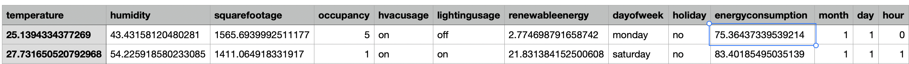
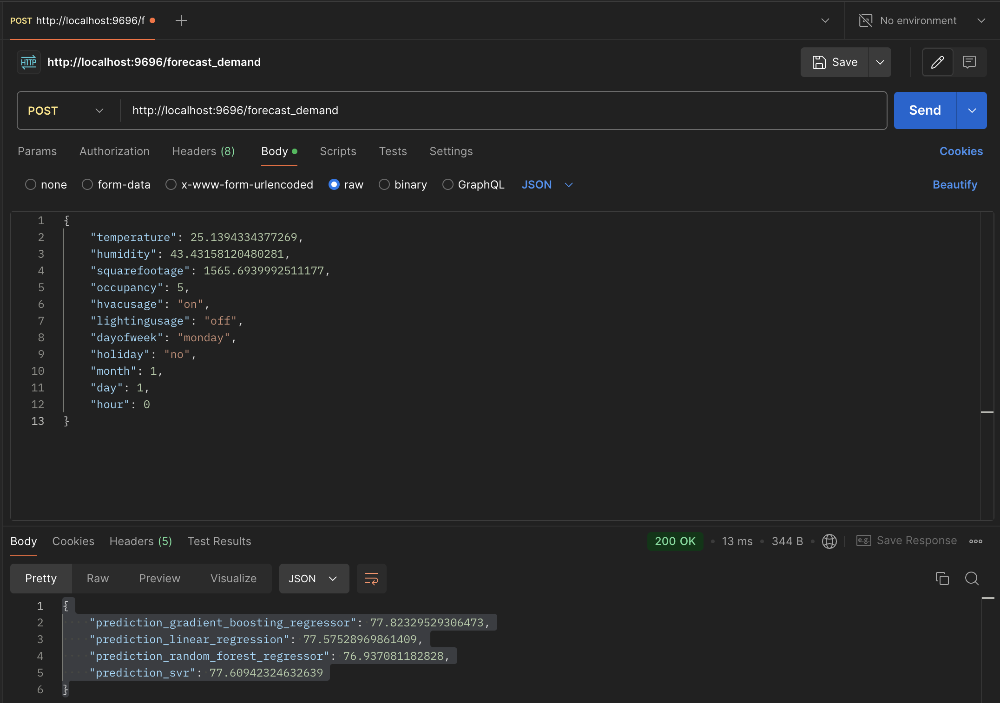
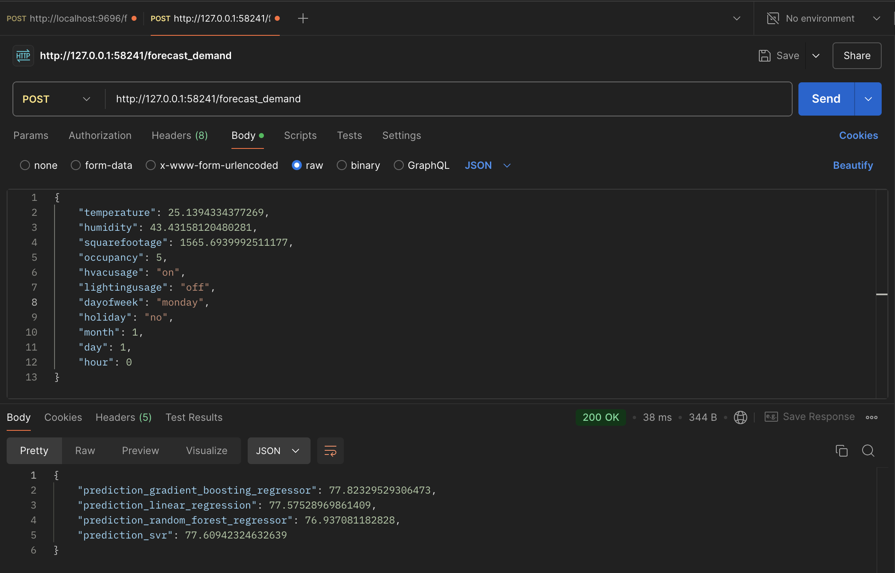
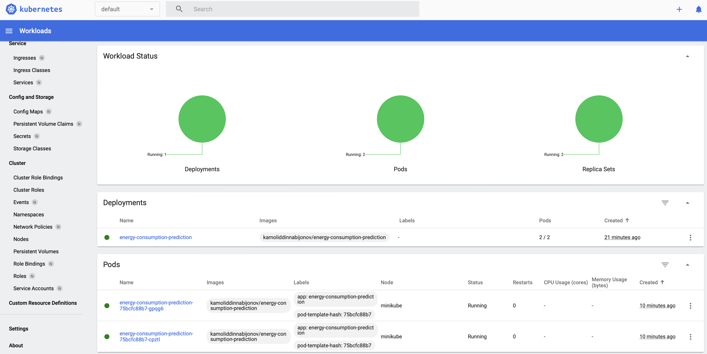

# Predicting Household Energy Consumption

## Problem Statement:

**Objective:**
The goal of this project is to develop regression-based predictive models to forecast household energy consumption accurately. The model aims to provide insights into energy usage patterns, enabling better resource management, cost optimization, and sustainable energy practices.

**Background:**
With the increasing demand for energy and the push towards smarter, sustainable energy solutions, accurate forecasting of household energy consumption is essential for energy providers and consumers. Predicting energy consumption can assist in:
1) Balancing supply and demand in real-time.
2) Reducing energy wastage and improving efficiency.
3) Supporting decision-making for renewable energy integration and peak load management.

**Challenges:**
The problem involves addressing:
1) Variability in energy usage patterns due to factors such as time of day, weather conditions, and household activities.
2) Handling seasonal and periodic trends in energy consumption data.

**Expected Outcome:**
A robust regression model capable of forecasting household energy consumption after being provided core features as input. The model will provide actionable insights for stakeholders, including energy providers and households, by enabling them to plan and optimize energy usage effectively. In addtion, the model must be deployed as API to interact with it using HTTPS requests.


## Dataset Description:

**Dataset URL:** https://www.kaggle.com/datasets/mrsimple07/energy-consumption-prediction/data 

**Dataset Summary:**
This synthetic dataset is designed to model energy consumption in a simulated environment, providing a rich set of features for analysis and predictive modeling. It includes data points across multiple timestamps, with attributes capturing environmental, operational, and temporal factors influencing energy usage. 

**Key Features:**
| Feature         |	Description                                                                          |
|-----------------|--------------------------------------------------------------------------------------|
|Timestamp        |	Chronological time record for each data point.                                       |
|Temperature      |	Simulated ambient temperature (°C).                                                  |
|Humidity         |	Simulated relative humidity (%).                                                     |
|SquareFootage    |	Size of the environment (square feet).                                               |
|Occupancy        |	Number of occupants present (integer).                                               |
|HVACUsage        |	HVAC system's operational state ('On' or 'Off').                                     |
|LightingUsage    |	Lighting system's operational state ('On' or 'Off').                                 |
|RenewableEnergy  |	Contribution of renewable energy sources (%).                                        |
|DayOfWeek        |	Day of the week (categorical).                                                       |
|Holiday          |	Indicates if the day is a holiday ('Yes' or 'No').                                   |
|EnergyConsumption|	Simulated energy consumption, derived from other features using a simplified formula.|

**Highlights:**
The dataset simulates real-world scenarios, offering a diverse range of features that affect energy usage.
Each record represents a snapshot of a hypothetical environment, capturing complex relationships between operational states, environmental conditions, and energy consumption.
Designed for experimentation, the dataset is ideal for building regression models, exploring time-series analysis, or conducting feature engineering.

**Assets:**
There is a local directory called datasets which includes the following files:
`energy_consumption_raw.csv` - the original dataset downloaded from Kaggle.
`energy_consumption_processed.csv` - fully processed file which will be used in model training stage. 

## Dataset Pre-processing and EDA:
In the file called `processing_and_EDA.ipynb` you can find all steps that were performed on the dataset including EDA itself.
The dataset was first loaded using pandas. All columns were transformed into unified format like `column_name`. The timestamp column was processed into multiple columns to reduce the granularity of this feature. All string records were lowercased.
On later stages, the full statistics of the dataset was reviewed including feature correlation and general EDA steps like relationship of each feature to target variable. The target variable was analyzed to check it's distribution and to understand if dataset is biased or not.

The resulting filed produced is called `energy_consumption_processed.csv` and stored in datasets directory together with the initial dataset.

## Model Training:
The `.csv` dataset from previous step if loaded into jupyter notebook called `model_training.ipynb` where we have trained the following models:
- **Linear Regression:** RMSE 4.87
- **Gradient Boosting Regressor:** RMSE 5.40
- **Random Forest Regressor:** RMSE 5.22
- **SVR:** RMSE 5.35

All models were trained using their default params except Random Forest. I have decided to pick this model for parameter tuning step because we can find best params using simple brute-force approach. As a result I was able to obtain best parameters for `max_depth` and `n_estimators` and get final RMSE of `5.17` on validation and `5.22` on test datasets.

In addition, Random Forest model can show us importance score for each feature. The scores were extracted with `temperature` being the most important one.

The resulting script was extracted as a standalone `.py` script called `model_training.py` which can be used to retrain all models. 

To **run this script** please execute commands below:
1) `pipenv install`
2) `pipenv shell`
3) `python model_training.py`


## Deployment and Containerization:
The model is deployed as a flask application and as a docker container. The file called `main.py` contains the core logic of web service. The app itself is served using gunicorn. 

**Run Flask application:**
```
pipenv install
pipenv shell
pipenv run gunicorn --bind 0.0.0.0:9696 main:app
```

**Run application as a docker container:**
```
docker build -t energy-consumption-prediction .
docker run -it --rm -p 9696:9696 energy-consumption-prediction
```

## Testing:
To test the application, the `POST` request must be send to `http://localhost:9696/forecast_demand`

Here is the payload sample that can be used:

**Request:**
```
{
    "temperature": 25.1394334377269,
    "humidity": 43.43158120480281,
    "squarefootage": 1565.6939992511177,
    "occupancy": 5,
    "hvacusage": "on",
    "lightingusage": "off",
    "dayofweek": "monday",
    "holiday": "no",
    "month": 1,
    "day": 1,
    "hour": 0
}
```

**Response:**
```
{
    "prediction_gradient_boosting_regressor": 77.82329529306473,
    "prediction_linear_regression": 77.57528969861409,
    "prediction_random_forest_regressor": 76.937081182828,
    "prediction_svr": 77.60942324632639
}
```

**Actual value:** 75.36437339539214

As you can see, the Random Forest was able to provide pretty accurate value for energy_consumption which is close to the actual value.





## Cloud Deployment:

For Cloud Deployment section I have decided to deploy my container to Kubernetes as it is the simplest option and because I don't want to spend huge amount of time to configure my AWS account.

**Tag and Push the image to Docker Hub:**
```
docker image tag energy-consumption-prediction kamoliddinnabijonov/energy-consumption-prediction
docker push kamoliddinnabijonov/energy-consumption-prediction
```

**Install kubectl and check:**
```
brew install kubectl
kubectl version --client
```

**Set Up the Kubernetes Cluster:**
To deploy your application, you need to set up a Kubernetes Cluster that will run your pods and services. There are lot of clusters provided by multiple cloud providers like Google, Amazon and Microsoft. For this application, we will use Minikube.

Install minikube, check it's version and run:
```
minikube version
minikube start
```

**Create the Pod, Deployment, and Service:**

Required configuration files are `deployment.yaml` and `service.yaml`.

```
kubectl apply -f deployment.yaml
kubectl apply -f service.yaml
kubectl get pods

NAME                                             READY   STATUS    RESTARTS   AGE
energy-consumption-prediction-75bcfc88b7-cpztl   1/1     Running   0          7m59s
energy-consumption-prediction-75bcfc88b7-gpqg6   1/1     Running   0          7m55s
```

**Access the Application:**
```
minikube dashboard
minikube service energy-service --url
```



